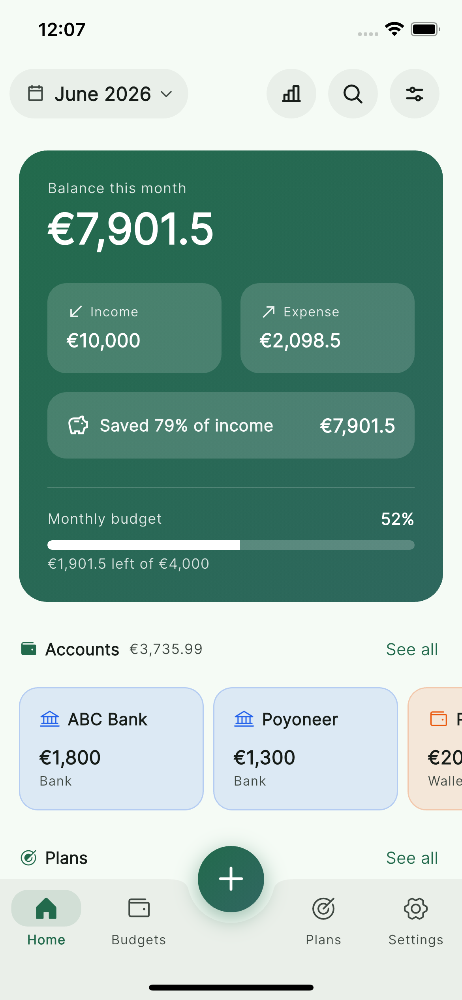
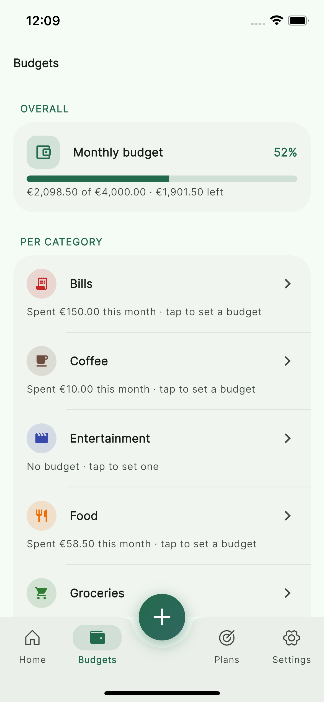
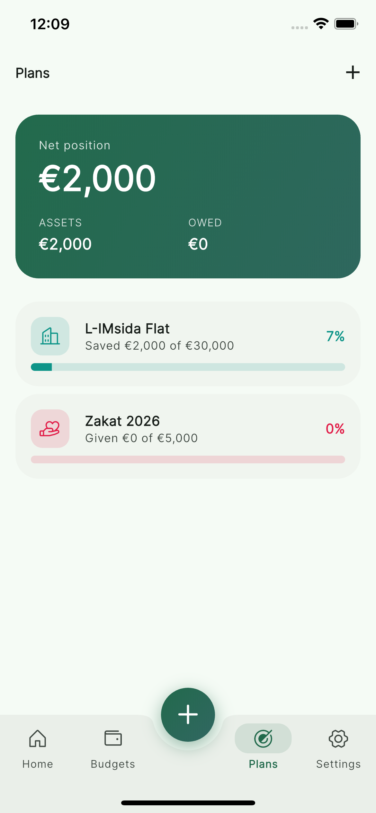
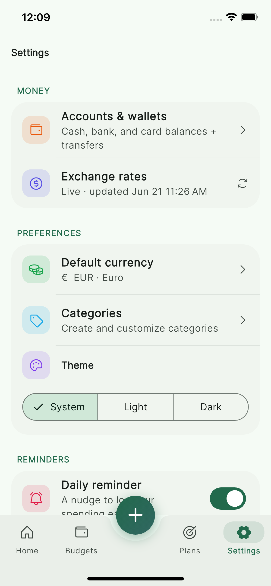

<div align="center">

# Jeb

### A private, local-first expense tracker built with Flutter

Track spending, budgets, accounts, and savings goals — your data lives on your
device and your own iCloud, never on anyone else's servers.

[](https://flutter.dev)
[](https://dart.dev)
[](#)
[](LICENSE)
[](#testing)


</div>

---

## Why Jeb

Most money apps want your bank logins and ship your transactions to a server.
**Jeb keeps everything on-device** in a local SQLite database, and syncs
privately through _your own_ iCloud — there's no Jeb account, no backend, no
analytics. It's fast, works offline, and is yours.

## Features

**💸 Transactions** — income & expense, custom categories, recurring rules,
optional receipt photos, full‑text search & filtering, and smart money
formatting (Lakh/Crore for South‑Asian currencies, K/M/B otherwise).

**👛 Accounts & wallets** — cash, bank, card, and wallet balances with opening
amounts, a per‑account history, and transfers between accounts (cross‑currency
aware). Archive accounts you no longer use.

**🎯 Plans** — long‑running goals as _assets_, _loans_, or _giving_ (e.g. zakat),
each with progress and a rolled‑up **net position** (assets − liabilities).

**📊 Budgets & insights** — an overall and per‑category monthly budget, plus an
Insights screen with a spending‑trend chart, a per‑month budget check (when you
went over and _why_), top categories, and a savings rate. Pick **3M / 6M / 12M**
presets (trailing windows that always include the current month) or a **custom
month range**.

**🌍 Live exchange rates** — multi‑currency totals use live FX (fetched from a
free, key‑less source, cached on device) with a bundled offline fallback.

**🧩 Customizable home** — drag to reorder and toggle the home dashboard
sections (summary, accounts, plans, spending, recent).

**☁️ Private cloud sync** — to the user's **own iCloud** on Apple and their
**own Google Drive** on Android (last‑write‑wins merge, soft‑delete tombstones,
receipt‑file sync; backs up on open and as you leave the app). No Jeb account,
no server.

**🔒 Privacy & security** — biometric app lock (Face ID / fingerprint), daily
reminder, CSV/PDF export, and light / dark / system themes (Material 3 + Inter).

## Screenshots

|                 Home                  |                   Budgets                   |                  Plans                  |                      Settings                       |
| :-----------------------------------: | :-----------------------------------------: | :-------------------------------------: | :-------------------------------------------------: |
|  |  |  |  |

## Architecture

Clean Architecture, one folder per feature, with Cubit (`flutter_bloc`) for
presentation state and `get_it` for dependency injection.

```
lib/
├── core/            # theme, DI, services (forex, notifications, export), shared utils & widgets
└── features/
    ├── transactions/   accounts/   budgets/   plans/   insights/
    ├── recurring/      settings/   home/      app_shell/
        ├── domain/        # entities, repository contracts, use cases (pure Dart)
        ├── data/          # models, datasources (sqflite), repository impls
        └── presentation/  # cubits, pages, widgets
```

Each use case returns `Either<Failure, T>` (`dartz`); the data layer owns sync
metadata (`updatedAt`, soft‑delete) so it never leaks into the domain.

## Tech stack

`flutter_bloc` · `get_it` · `dartz` · `equatable` · `sqflite` ·
`shared_preferences` · `icloud_storage` · `fl_chart` · `phosphor_flutter` ·
`google_fonts` · `pdf` / `printing` · `share_plus` · `local_auth` ·
`flutter_local_notifications` · `image_picker` · `intl` · `uuid`

## Getting started

```bash
# Flutter 3.9+ required
flutter pub get
flutter run
```

**Backup setup:**

- **iOS / macOS** — uses the user's own iCloud automatically. To run on a
  physical iPhone, set your own bundle id and iCloud container in Xcode.
- **Android** — backs up to the user's own Google Drive after a one‑time
  Google sign‑in. This needs your own Google Cloud OAuth client — see
  [`docs/google-drive-setup.md`](docs/google-drive-setup.md). Until connected,
  data stays local on the device.

Generate launcher icons / splash (optional):

```bash
dart run flutter_launcher_icons
dart run flutter_native_splash:create
```

## Testing

```bash
flutter test       # unit & widget tests
flutter analyze    # static analysis
```

## Roadmap ideas

- Sync the home layout & FX preferences across devices
- Swipe between months on the home screen
- Per‑account currency conversion in transfers history
- More chart types in Insights

## Contributing

Issues and PRs are welcome. Please run `flutter analyze` and `flutter test`
before opening a PR.

## Sponsor

If Jeb is useful to you, consider sponsoring its development — it's built and
maintained in the open. See the **Sponsor** button at the top of the repo, or
[github.com/sponsors/iammujtaba44](https://github.com/sponsors/iammujtaba44).

## License

Released under the [MIT License](LICENSE) — © 2026 Mujtaba.
